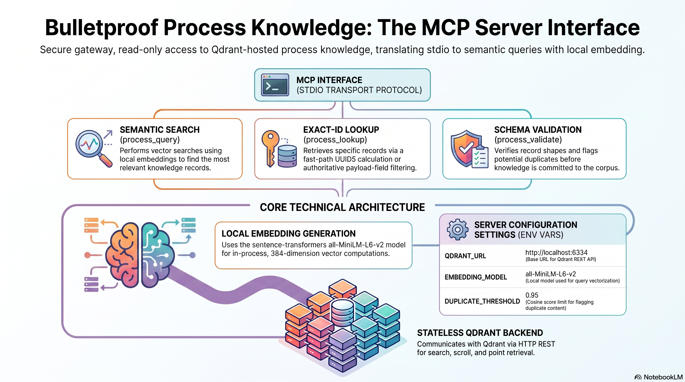

# bulletproof-process-knowledge-mcp

MCP server exposing the `process_knowledge` Qdrant collection through three tools:



> Deep-dive docs live in [`docs/`](docs/); generated media (infographic, slide deck, video overview, briefing report) live in [`docs/media/`](docs/media/).

| Tool | Purpose |
|------|---------|
| `process_query` | Semantic search over the process knowledge base |
| `process_lookup` | Exact-id record lookup |
| `process_validate` | Validate a candidate record + detect duplicates |

## Configuration

| Env var | Default | Notes |
|---------|---------|-------|
| `QDRANT_URL` | `http://localhost:6334` | Qdrant HTTP REST endpoint |
| `QDRANT_API_KEY` | _(none)_ | Optional bearer key |
| `EMBEDDING_MODEL` | `sentence-transformers/all-MiniLM-L6-v2` | 384-dim |
| `SCHEMA_PATH` | `/knowledge/_schema.yaml` | Knowledge schema for validation |
| `KNOWLEDGE_ROOT` | `/knowledge` | Source YAML root (read-only) |
| `AUDIT_BUS_URL` | _(none)_ | Optional POST endpoint for tool invocation events |
| `DUPLICATE_THRESHOLD` | `0.85` | Cosine similarity above this flags potential duplicate |

## Running

### Local (stdio for MCP host)
```
pip install -r requirements.txt
python server.py
```

### Docker
```
docker build -t process-knowledge-mcp .
docker run --rm -i \
  -e QDRANT_URL=http://localhost:6334 \
  -e QDRANT_API_KEY="$QDRANT_API_KEY" \
  -v /path/to/knowledge:/knowledge:ro \
  process-knowledge-mcp
```

### CLI test mode
```
python server.py query  '{"query":"docker security","limit":3}'
python server.py lookup '{"id":"SEC-CIS-001"}'
python server.py validate '{"candidate":{"id":"DEV-NEW-001","knowledge_type":"rule","name":"x","condition":"y","action":"z","domain":"development.testing","source":"manual","effective_date":"2026-05-01","status":"active"},"target_domain":"development"}'
```

## MCP Host Registration

Add to `mcp.json` or equivalent host config:
```json
{
  "process-knowledge": {
    "command": "docker",
    "args": ["exec", "-i", "process-knowledge-mcp", "python", "/app/server.py"]
  }
}
```

Or stdio direct:
```json
{
  "process-knowledge": {
    "command": "python",
    "args": ["/path/to/bulletproof-process-knowledge-mcp/server.py"],
    "env": {
      "QDRANT_URL": "http://localhost:6334",
      "QDRANT_API_KEY": "<secret>",
      "SCHEMA_PATH": "/path/to/knowledge/_schema.yaml"
    }
  }
}
```


## License

Apache-2.0 — see [LICENSE](LICENSE) and [NOTICE](NOTICE).
